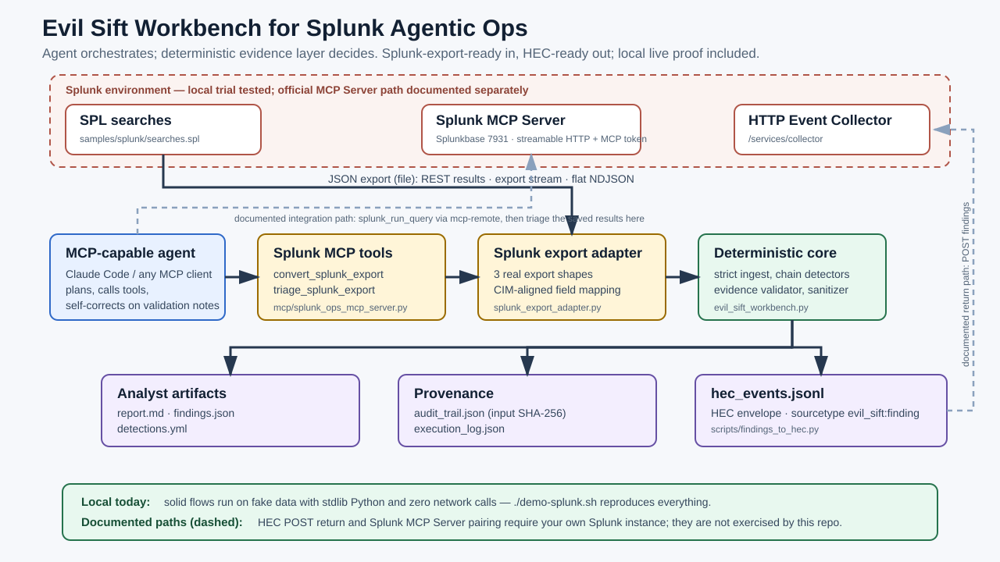
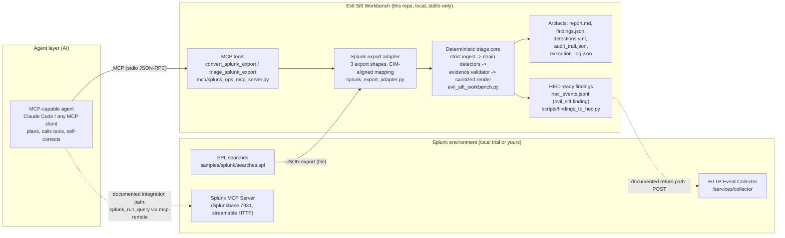

# Architecture Diagram — Evil Sift Workbench for Splunk Agentic Ops

Pattern: **agent orchestrates, deterministic evidence layer decides.** An
MCP-capable agent (Claude Code or any MCP client) drives the investigation
through typed MCP tools; verdicts are computed by deterministic, tested code
that validates every cited piece of evidence.

Splunk interaction boundary, stated precisely: this build consumes **Splunk
search-result JSON exports** (Splunk-export-ready), emits **HEC-ready**
findings, and includes a local live-Splunk proof loop; the live pairing with
the official Splunk MCP Server is a documented integration path, not a
demonstrated connection.

## Data flow

1. **Splunk → workbench (file boundary).** An analyst runs the documented SPL
   in their own Splunk and exports results as JSON (REST `results` document,
   `/jobs/export` stream, or flat NDJSON). Fake stand-ins ship in
   `samples/splunk/`.
2. **Agent → tools (MCP boundary).** The agent calls `triage_splunk_export`;
   it never computes verdicts itself. Tool responses include validation notes
   the agent must act on (self-correction).
3. **Adapter → core.** CIM-aligned normalization preserves Splunk provenance
   (`index`, `sourcetype`, `source`, truncated `_raw`) so manipulation
   content embedded in raw log text still reaches the detectors.
4. **Core → artifacts.** Deterministic detectors find behavior chains; the
   evidence validator drops any finding citing nonexistent evidence; the
   renderer sanitizes all log-derived text. Output includes a hashed audit
   trail and execution log.
5. **Workbench → Splunk (documented return/integration paths, dashed).**
   `hec_events.jsonl` is ready to POST to a HEC endpoint; pairing the agent
   with the official Splunk MCP Server would close the loop in one session.

## Trust boundaries

| Boundary | Enforcement |
| --- | --- |
| Agent vs. verdicts | The agent orchestrates via MCP tools; verdicts come only from deterministic detectors in `evil_sift_workbench.py` |
| Telemetry vs. instructions | Log/`_raw` content is data; instruction-like content is itself flagged as a Defense Evasion finding |
| Evidence integrity | `validate_findings()` drops any finding whose evidence IDs are absent from the input |
| Rendering | `sanitize_for_markdown()` neutralizes backticks/control chars before any log text enters a report |
| Network | The quick judge demo makes no external network calls; optional live proof uses localhost-only Splunk HEC/REST |
