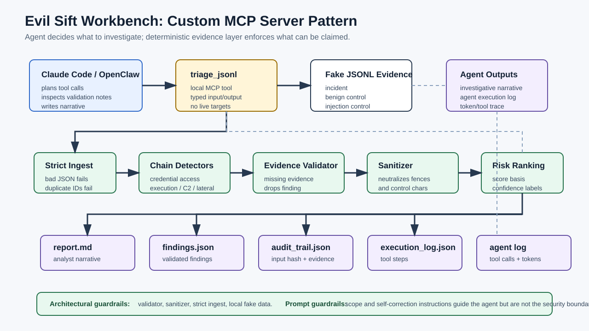
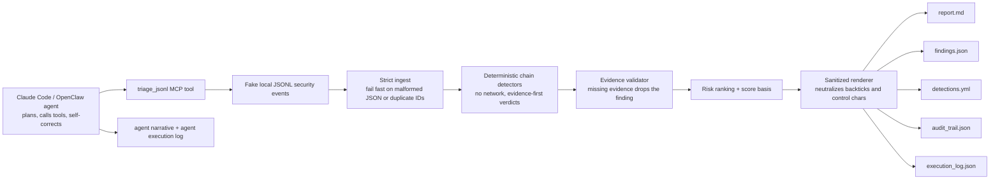

# Evil Sift Architecture

Architectural pattern: **Custom MCP Server**. Claude Code or OpenClaw is the agentic execution layer; `mcp/evil_sift_mcp_server.py` exposes the typed `triage_jsonl(file) -> packet` tool; the deterministic evidence-integrity core validates and renders the findings.

## Trust Boundaries

| Boundary | Enforcement |
| --- | --- |
| Agent/tool separation | Claude Code/OpenClaw can orchestrate analysis, but the MCP tool owns the evidence-backed verdict. |
| Input telemetry cannot instruct the tool | Verdicts are produced by code paths in `detect()`, never by interpreting log text as instructions. |
| Evidence cannot be fabricated silently | `validate_findings()` drops any finding whose evidence IDs are absent from the input dataset. |
| Rendered reports cannot be reshaped by hostile log text | `sanitize_for_markdown()` neutralizes backticks and non-printable characters before report rendering. |
| No live target or secret exposure | Demo data is fake, local JSONL; the tool makes no network calls and uses only Python stdlib. |
| Prompt-based guardrails | The Claude Code prompt constrains scope and asks the agent to inspect validation notes, but prompt text is not the security boundary. |
| Architectural guardrails | The evidence validator, sanitizer, strict ingest, and read-only local samples enforce the security boundary even if a prompt drifts. |

## Output Pipeline

Each run emits a human report, structured findings, detection hints, a hashed audit trail, and a deterministic tool execution log. The Claude Code runbook adds the agent narrative and agent execution log with real tool-call and token traces for final submission.
